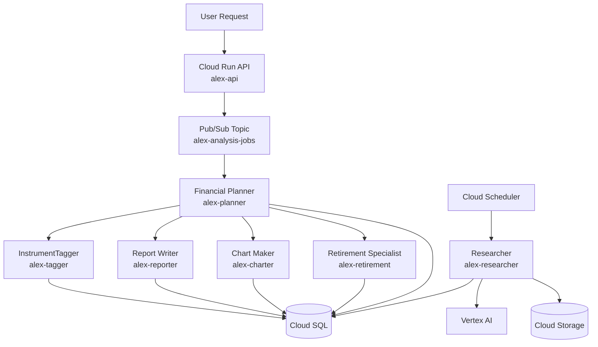

# Alex Agent Architecture (GCP Runtime)

This document shows how Alex agents collaborate on GCP to generate portfolio analysis outputs.

## Collaboration Overview

## Agent Roles

### Planner (Orchestrator)
- Consumes analysis jobs from Pub/Sub.
- Loads portfolio context from Cloud SQL.
- Invokes specialist services (`tagger`, `reporter`, `charter`, `retirement`).
- Tracks job lifecycle (`queued` → `running` → `completed/failed`).

### Tagger
- Enriches missing instrument metadata.
- Writes classification data back to Cloud SQL.

### Reporter
- Produces narrative portfolio analysis.
- Stores markdown/report artifact in Cloud SQL.

### Charter
- Produces chart-ready JSON payloads.
- Stores visualization payloads in Cloud SQL.

### Retirement
- Produces retirement projection outputs.
- Stores projection artifacts in Cloud SQL.

### Researcher (Autonomous)
- Runs on schedule (Cloud Scheduler).
- Uses Vertex AI for market research generation.
- Persists outputs to Cloud Storage/Cloud SQL for later retrieval/context.

## Communication Patterns

1. **API → Queue pattern**
   - API publishes analysis request to Pub/Sub.

2. **Queue → Orchestrator pattern**
   - Planner consumes queue message and coordinates work.

3. **Orchestrator → Specialist fan-out**
   - Planner calls specialist Cloud Run services in sequence/parallel based on workflow.

4. **Shared persistence**
   - All agents read/write through Cloud SQL for consistent state.

5. **Autonomous enrichment loop**
   - Researcher periodically enriches knowledge and stores context artifacts.

## Runtime Notes for GCP

- Agent services are containerized and deployed to Cloud Run.
- AI model path is Vertex-backed (`vertex_ai/...` model references in agent code).
- Queueing uses Pub/Sub, not SQS.
- Observability uses Cloud Monitoring + Cloud Logging.

## Backend API Dependency Map

To get a working backend API, these dependencies must be healthy:

1. `alex-api` Cloud Run service
2. Cloud SQL connectivity via `DATABASE_URL`
3. Pub/Sub topic `alex-analysis-jobs`
4. Planner subscription and service runtime
5. Clerk JWKS configuration for auth
