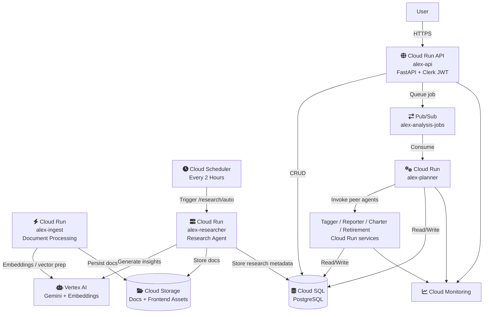

# Alex Architecture Overview (GCP Version)

## System Architecture

Alex now runs as a serverless architecture on **Google Cloud Platform** with Cloud Run, Pub/Sub, Cloud SQL, Vertex AI, and Cloud Storage.

## Core Components

### 1) Cloud Run Services
- `alex-api` (FastAPI backend for frontend)
- `alex-ingest` (document ingestion)
- `alex-researcher` (autonomous research)
- `alex-planner`, `alex-tagger`, `alex-reporter`, `alex-charter`, `alex-retirement` (agent orchestra)

### 2) Cloud SQL (PostgreSQL)
- System of record for users, portfolios, jobs, reports, and chart/projection artifacts.

### 3) Pub/Sub
- Asynchronous job queue for analysis requests.
- API publishes; planner subscribes and orchestrates downstream agent calls.

### 4) Vertex AI
- Model inference path for agent reasoning and content generation.
- Embeddings/vector-related processing path for ingestion/research workflows.

### 5) Cloud Storage
- Stores ingestion files and static frontend artifacts.

### 6) Cloud Scheduler
- Optional recurring trigger for autonomous research cycles.

### 7) Cloud Monitoring
- Dashboards and service-level observability for API, agents, queue depth, and DB health.

## Data Flow

1. **User-triggered portfolio analysis**
   - User → `alex-api` → Cloud SQL + Pub/Sub
   - Planner consumes queue message, orchestrates specialist agents
   - Agents write results to Cloud SQL
   - Frontend fetches completed outputs from API

2. **Autonomous research cycle**
   - Cloud Scheduler → `alex-researcher`
   - Researcher uses Vertex AI and stores outputs (Cloud Storage/DB)

3. **Ingestion flow**
   - Ingest endpoint receives documents
   - Ingest processes with Vertex path
   - Outputs stored in Cloud Storage (and metadata in DB as needed)

## Deployment Model

- Infrastructure is defined in independent Terraform directories (`terraform/2_*` through `terraform/8_*`) using the **Google provider**.
- Each directory remains deployable independently for incremental progress.

## Working-Backend-API Gate

You can proceed confidently when:

1. `alex-api` is healthy on Cloud Run.
2. API can read/write Cloud SQL through `DATABASE_URL`.
3. API can publish jobs to `alex-analysis-jobs`.
4. `alex-planner` consumes jobs and updates job status/results.
5. Clerk JWT auth works end-to-end on protected `/api/*` routes.
